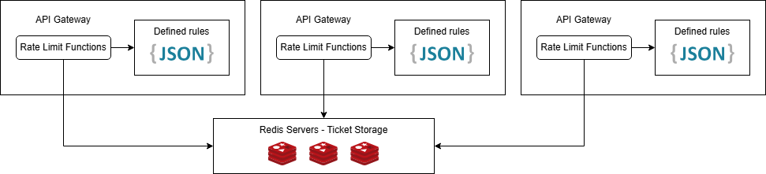

# Rate Limit Core Function

## Requirements

- Ensuring resistance against Brute Force Attacks & DDOS attacks.
- Able to be deployed in a cluster model & only executing on the API gateway instance.

## Design

- There are several components that should appear in the overall architecture of the rate limiting components

    - Rules Storage: Define the rules (how many requests per seconds, rules for each components...)
    - Identifier & Status Storage: To deploy rate limit service on cluster model, every instance should have a shared storage to check the current status of a request based on its identifier. Should be implemented using a key-value based storage like Redis.
    - Rate Limit Core Functions: Handle the logic behind the rules & active status, decide whether a request should go through or not.

- Based on requirements, the rate limit does not require 100% accuracy (its purpose is to resist DDOS attacks & protect backend servers) and requires a shared storage between different API gateway instances.

- Also, the decision making process must be fast and cause minimal overhead to the workload of the server => The algorithm behind must have constant complexity (O(1)) and the functions must be integrated into the gateway instead of being an external service.

- With such components & requirements in mind, here is the overall architecture of a rate limit solution integrated into an API gateway.

- Overview & simplified architecture




## Implementation

- Rate limiting function should be upgraded from the solution in the 1st part as such solution is not efficient in terms of memory and time complexity. So the algorithm would be a more greedy-like solution which would have the complexity of O(1) and only store necessary keys.

- The algorithm can be stated as follow:

    - Whenever a client is connected to the API gateway, the status of its rate limit monitor would be updated with the following rules

        - If the key (created using IP address, user agent or any unique identifiers) does not exist, create a key-value pair with the key as the identifier and the value as the rate limit threshold minus 1 (for the current request). The key would have a time to live value matching with the interval of the rate limit

        - If the key is exist, the value would be **decreased by 1**. If the value is then below 0, we would **reject** the request. We may implement further optimization here (exponential backoff by extending time-to-live if the client keeps requesting after being blocked)

        - The key would be automatically cleared from Redis instance after the interval ends.

- Pseudo code

```
def unique_key(client):
    return client.ip

def ticket_left(client):
    value = maps.get(unique_key(client))
    if value == Null:
        maps.put(unique_key(client), threshold - 1, interval)
        return threshold - 1
    else:
        maps.put(unique_key(client), value - 1, // keep ttl)
        return value - 1


def valid(client):
    ticket_left = ticket_left(client)
    if ticket_left < 0:
        return False
    return True 
```

